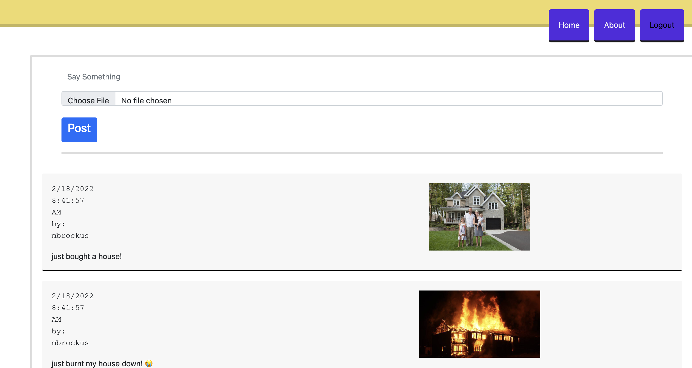
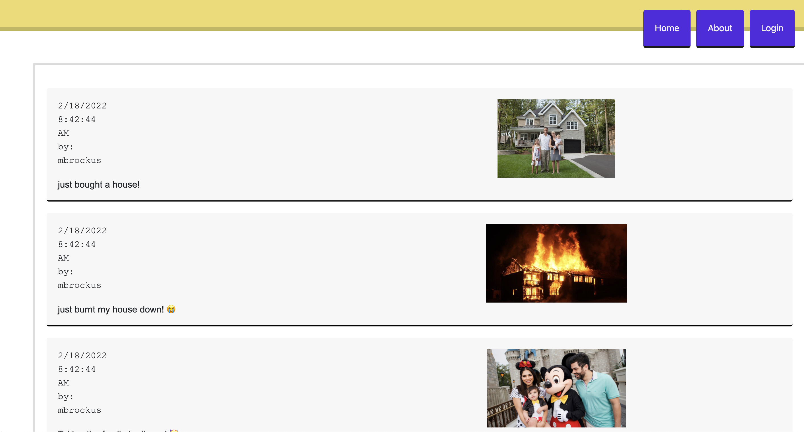
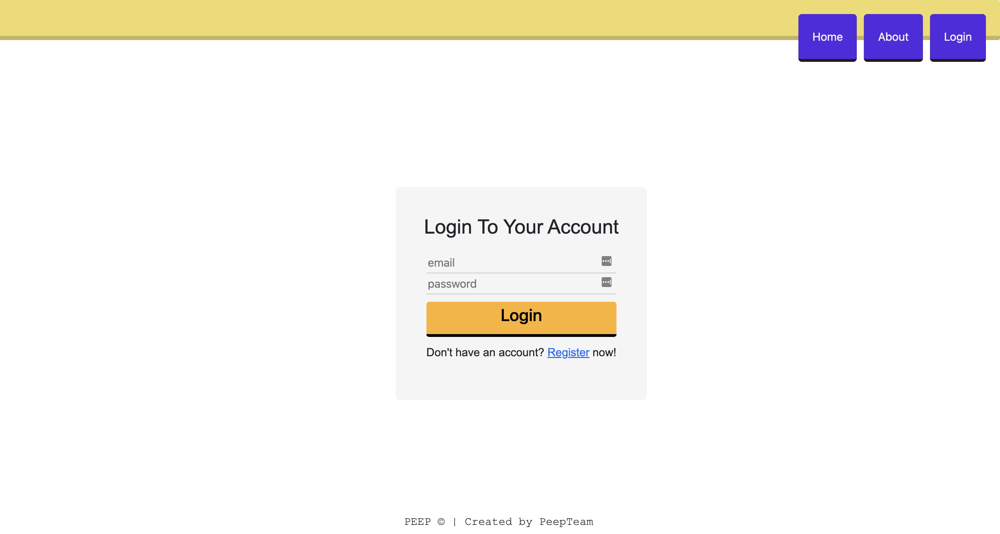
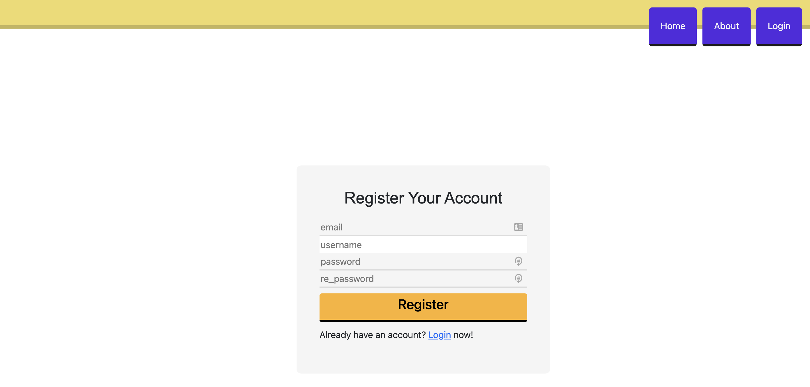
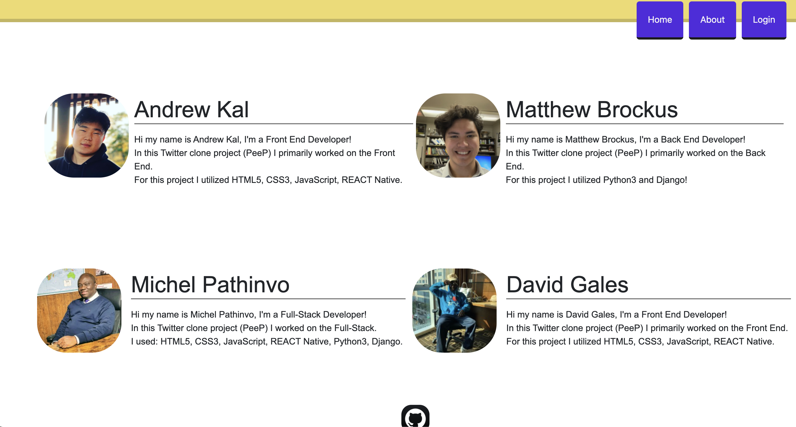

# PeeP

## Screenshots of application

### Home logged in screen

### Home logged out screen

### Login screen

### Register new user screen

### About screen

## Description
PeeP is a social media site focused on families! Users can create profiles, and upload images with text descriptions which other users can see.

## Features

Users can create an account with an email, username, and password. All site visitors can see all posts on the webpage. If a user has an account and is logged in, they can post a new post with an image and text.

## List of Technologies Used

- Javascript
- CSS
- React
- Bootstrap
- Python
- Django
- AWS

## Getting Started

in order to run this app locally, fork and clone this repository, install all dependencies, then run on a local server.

## Contribution guidelines

#### Main repo
- https://github.com/Peep-Coders/peep-frontend
#### Issue Tracker
- https://github.com/Peep-Coders/peep-frontend/issues
